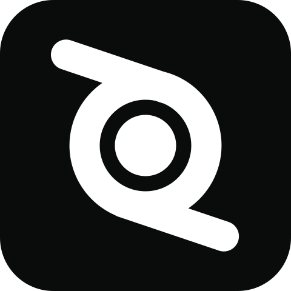

<p align="center">
  
</p>

# BlendUp

**Tes assets Blender, avec ou sans moteur de jeu.**

BlendUp est une application de bureau pour organiser des assets Blender dans un projet **3D sans moteur**, ou les exporter vers **Godot** ou **Unity**. Elle se concentre sur trois espaces : **Assets**, **Problèmes** et **Paramètres**.

> État du projet : première version fonctionnelle en développement. Les installateurs publiés dans les Releases GitHub sont les versions recommandées pour les tests.

## Ce que fait BlendUp

- conserve chaque asset dans un dossier autonome avec son `.blend`, ses textures, références et rendus ;
- ouvre un asset dans la session Blender déjà lancée quand l'add-on est actif ;
- exporte en `.glb` vers Godot ou en `.fbx` vers Unity en conservant l'arborescence de `Art` ;
- affiche les dossiers réellement présents dans `Art` avec recherche, favoris, vues et glisser-déposer ;
- montre les aperçus 3D, miniatures, images, textures, notes et tags ;
- crée de vraies variantes `.blend`, navigables et exportables séparément ;
- génère des LOD Blender éditables à 50 %, 25 % et 12,5 % ;
- exporte l'asset principal, toutes ses variantes et tous ses LOD en une action ;
- signale uniquement les problèmes utiles : export absent, obsolète ou en erreur.

Les anciens modules Git, tâches, équipe, références, nomenclature, dashboard, widget Unity et génération de prefabs ont été retirés.

## Flux de travail

Un projet **3D · Sans moteur** contient uniquement `Art` et la configuration `.blendup` : aucun projet Godot ou Unity n'est créé. Notes, tags, images, favoris, variantes et LOD restent disponibles. **Générer l'aperçu** produit un GLB temporaire dans `.blendup/cache/previews`, sans obligation d'export ni alerte d'export manquant. Le type de projet peut être changé dans les paramètres en conservant les fichiers existants.

```text
MonProjet/
├─ .blendup/                       configuration locale du projet
├─ Art/
│  └─ Props/Table/
│     ├─ Table.blend              version principale
│     ├─ Table.variant.red.blend  variante éditable
│     ├─ Table.lod.lod1.blend     LOD éditable
│     ├─ textures/
│     ├─ references/
│     └─ renders/
└─ Godot/Assets/Props/Table/
   ├─ Table.glb
   ├─ variants/red.glb
   ├─ lods/lod1.glb
   └─ Table_lod.tscn
```

Avec Unity, le même principe est utilisé sous `Unity/Assets`, avec des exports `.fbx`. Changer de moteur dans les paramètres crée la nouvelle organisation sans supprimer l'ancien dossier.

## Utilisation rapide

1. Installe BlendUp depuis la page **Releases** du dépôt.
2. Installe [`apps/blender-addon/blendup.zip`](apps/blender-addon/blendup.zip) depuis les préférences de Blender.
3. Dans BlendUp, crée ou ouvre un projet, puis indique le chemin de Blender dans **Paramètres**.
4. Crée un asset dans `Art`, travaille dans Blender, puis utilise **Exporter** ou **Tout exporter**.

Pour les détails, consulte [le guide d'utilisation](docs/utilisation.md) et [le guide des variantes et LOD](docs/variants-et-lod.md).

## Installation et compilation

Les instructions complètes pour Windows et Linux sont dans [Compiler et installer BlendUp](docs/BUILDING.md).

Le démarrage développeur tient en quatre commandes :

```text
npm install
npm test
npm run build
npm run tauri:dev
```

## Publier une version

Le workflow GitHub construit automatiquement les installateurs Windows et Linux lors de l'envoi d'un tag `v*`. La release est créée en brouillon pour permettre une dernière vérification avant publication.

La checklist complète est dans [Publier une release](docs/RELEASE.md).

## Architecture

- `apps/desktop` : interface React et application Tauri ;
- `apps/desktop/src-tauri` : fichiers, projets, export Blender et intégration système ;
- `apps/blender-addon` : add-on et scripts exécutés dans Blender ;
- `docs` : utilisation, architecture, compilation et release.

Voir également [l'architecture technique](docs/architecture.md) et [le guide de l'add-on Blender](apps/blender-addon/README.md).
